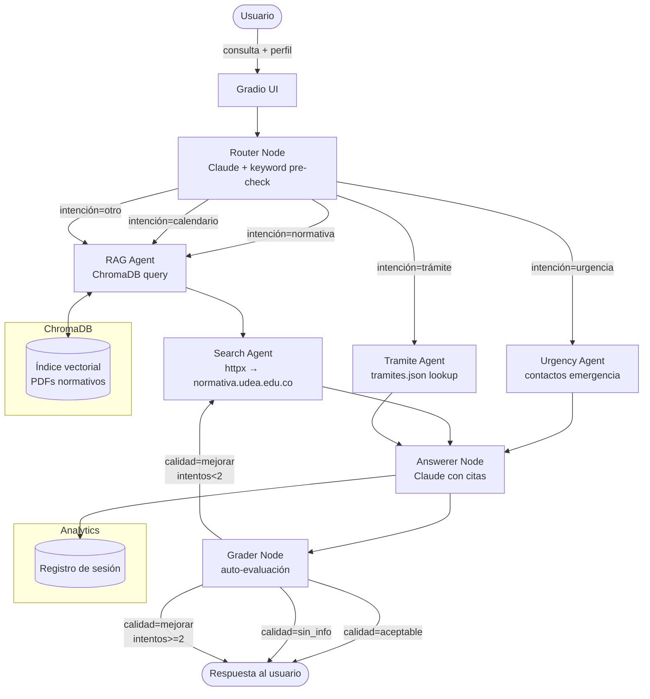

# Documento de Diseño — Copiloto Administrativo Agéntico UdeA

## Overview

El Copiloto Administrativo Agéntico es un sistema multi-agente diseñado para la Universidad de Antioquia que orquesta múltiples agentes especializados mediante LangGraph. El sistema combina recuperación aumentada por generación (RAG) con búsqueda web en tiempo real, auto-evaluación de respuestas y una interfaz multi-pestaña en Gradio.

El diferenciador técnico central es el **grafo de agentes con ciclo de calidad**: el nodo Grader evalúa cada respuesta y puede ordenar un reintento con búsqueda web adicional antes de presentar la respuesta al usuario. Esto lo distingue de un chatbot convencional de preguntas y respuestas.

**Stack tecnológico:**
- Python 3.11+
- LangGraph (orquestación de agentes)
- LangChain (cadenas de prompts y conectores)
- Anthropic Claude claude-3-5-haiku-20241022 (modelo LLM principal)
- ChromaDB (almacenamiento vectorial persistente)
- Gradio 4.x (interfaz web)
- httpx (cliente HTTP asíncrono para búsqueda web)
- PyMuPDF + pdfplumber (extracción de PDFs)
- sentence-transformers (embeddings fallback gratuito)

---

## Architecture

El sistema sigue una arquitectura de **grafo de agentes dirigido acíclico con ciclo de calidad controlado**. La siguiente figura muestra el flujo completo:



### Descripción del Flujo Principal

1. El usuario envía una consulta desde la interfaz Gradio con su perfil seleccionado.
2. El **Router** clasifica la intención y detecta urgencias con pre-check de keywords.
3. Según la intención, el flujo se dirige a **RAG_Agent**, **Tramite_Agent** o **Urgency_Agent**.
4. El **RAG_Agent** consulta ChromaDB; el resultado pasa al **Search_Agent** que enriquece con búsqueda web.
5. El **Answerer** genera la respuesta con citas usando Claude.
6. El **Grader** evalúa la calidad; si es "mejorar" y `intentos < 2`, reenvía al Search_Agent.
7. La respuesta final se presenta en la UI con alerta visual si hay urgencia.

---

## Components and Interfaces

### 1. Estado del Grafo (`agentes/estado.py`)

El Estado es el objeto central que viaja entre todos los nodos. Implementado como `TypedDict`:

```python
from typing import TypedDict, Annotated, List, Optional
from langgraph.graph.message import add_messages

class EstadoCopiloto(TypedDict):
    # Conversación
    mensajes: Annotated[list, add_messages]
    perfil_usuario: str                    # pregrado|posgrado|docente|administrativo

    # Clasificación
    intencion: str                         # normativa|trámite|calendario|urgencia|otro
    categoria: str
    es_urgente: bool
    nivel_urgencia: str                    # bajo|medio|alto|critico
    pregunta_reformulada: str

    # Documentos recuperados
    documentos_rag: List[dict]             # {contenido, fuente, articulo, pagina, score}
    documentos_web: List[dict]             # {contenido, url}

    # Trámites
    tramite_guia: Optional[dict]
    pasos_tramite: List[str]

    # Calendario
    fechas_relevantes: List[dict]          # {evento, fecha, periodo}

    # Generación
    respuesta_candidata: str
    fuentes_citadas: List[str]
    agente_usado: str

    # Control de calidad
    calidad: str                           # aceptable|mejorar|sin_info
    intentos: int
```

### 2. Router (`agentes/router.py`)

**Responsabilidad:** Clasificar la intención del usuario y detectar urgencias.

**Interfaz:**
```python
def router_node(estado: EstadoCopiloto) -> EstadoCopiloto:
    ...
```

**Lógica interna:**
1. Pre-check con lista de palabras clave críticas (sin llamada a LLM).
2. Si hay palabras clave críticas: `es_urgente=True`, `nivel_urgencia="critico"`.
3. Llamada a Claude con prompt de clasificación para determinar `intencion` y `categoria`.
4. Actualizar `pregunta_reformulada` con versión normalizada de la consulta.

**Palabras clave críticas (ejemplo):**
```python
PALABRAS_URGENCIA = [
    "suicidio", "hacerme daño", "no quiero vivir", "acoso", "violencia",
    "expulsión", "pérdida de cupo", "prueba académica", "emergencia"
]
```

**Enrutamiento condicional:**
```python
def decidir_ruta(estado: EstadoCopiloto) -> str:
    if estado["es_urgente"] and estado["nivel_urgencia"] == "critico":
        return "urgency_agent"
    match estado["intencion"]:
        case "trámite": return "tramite_agent"
        case _: return "rag_agent"
```

### 3. RAG Agent (`agentes/rag_agent.py`)

**Responsabilidad:** Recuperar fragmentos normativos relevantes desde ChromaDB.

**Interfaz:**
```python
def rag_agent_node(estado: EstadoCopiloto) -> EstadoCopiloto:
    ...
```

**Lógica:**
- Consulta a ChromaDB con la `pregunta_reformulada` filtrando por `categoria`.
- Retorna los top-6 fragmentos con score >= 0.3.
- Almacena resultados en `documentos_rag`.

### 4. Search Agent (`agentes/search_agent.py`)

**Responsabilidad:** Enriquecer con información del portal normativo en tiempo real.

**Interfaz:**
```python
async def search_agent_node(estado: EstadoCopiloto) -> EstadoCopiloto:
    ...
```

**Lógica:**
- Request a `normativa.udea.edu.co` con timeout de 10 segundos.
- Fallback a URL alternativa predefinida si el principal falla.
- Almacena en `documentos_web`.

### 5. Tramite Agent (`agentes/tramite_agent.py`)

**Responsabilidad:** Guiar paso a paso en trámites administrativos desde `tramites.json`.

**Interfaz:**
```python
def tramite_agent_node(estado: EstadoCopiloto) -> EstadoCopiloto:
    ...
```

**Algoritmo de búsqueda:**
- Tokenizar consulta.
- Calcular puntuación de coincidencia por `keywords` de cada trámite.
- Seleccionar trámite con mayor puntuación.
- Si puntuación = 0: delegar a RAG_Agent.

### 6. Urgency Agent (`agentes/urgency_agent.py`)

**Responsabilidad:** Detectar y escalar situaciones críticas.

**Lógica:**
- Mapear tipo de urgencia a contactos institucionales predefinidos.
- Agregar contactos al contexto para que Answerer los incluya.
- Marcar respuesta con bandera de urgencia para la UI.

### 7. Answerer (`agentes/answerer.py`)

**Responsabilidad:** Generar la respuesta final con Claude, integrando todas las fuentes.

**Prompt de sistema (extracto):**
```
Eres el Copiloto Administrativo de la Universidad de Antioquia.
Responde al usuario con perfil [{perfil_usuario}] usando la información disponible.
Cita las fuentes en el formato: (Fuente: X, Artículo Y, pág. Z).
Si hay pasos de trámite, preséntalos numerados.
Si no tienes información suficiente, indica los canales oficiales de consulta.
```

### 8. Grader (`agentes/grader.py`)

**Responsabilidad:** Auto-evaluar la calidad de la respuesta candidata.

**Lógica de evaluación:**
- `aceptable`: Respuesta tiene información relevante y citas verificables.
- `mejorar`: Respuesta incompleta o sin citas suficientes; hay posibilidad de mejora.
- `sin_info`: No se encontró información relevante en ninguna fuente.

**Decisión de reintento:**
```python
def decidir_post_grader(estado: EstadoCopiloto) -> str:
    if estado["calidad"] == "aceptable" or estado["calidad"] == "sin_info":
        return "fin"
    if estado["intentos"] < 2:
        return "search_agent"
    return "fin"
```

### 9. Grafo Principal (`agentes/grafo.py`)

```python
grafo = StateGraph(EstadoCopiloto)
grafo.add_node("router", router_node)
grafo.add_node("rag_agent", rag_agent_node)
grafo.add_node("search_agent", search_agent_node)
grafo.add_node("tramite_agent", tramite_agent_node)
grafo.add_node("urgency_agent", urgency_agent_node)
grafo.add_node("answerer", answerer_node)
grafo.add_node("grader", grader_node)

grafo.set_entry_point("router")
grafo.add_conditional_edges("router", decidir_ruta)
grafo.add_edge("rag_agent", "search_agent")
grafo.add_edge("search_agent", "answerer")
grafo.add_edge("tramite_agent", "answerer")
grafo.add_edge("urgency_agent", "answerer")
grafo.add_edge("answerer", "grader")
grafo.add_conditional_edges("grader", decidir_post_grader)

app_grafo = grafo.compile()
```

---

## Data Models

### tramites.json — Esquema de Trámite

```json
{
  "tramites": [
    {
      "nombre": "Certificado de Notas",
      "descripcion": "Solicitud de certificado oficial de calificaciones.",
      "categoria": "certificados",
      "tiempo_estimado": "3-5 días hábiles",
      "costo": "Gratuito para estudiantes activos",
      "oficina": "Registro y Control Académico",
      "url_oficial": "https://www.udea.edu.co/wps/portal/udea/web/inicio/institucional/registro-control",
      "keywords": ["certificado", "notas", "calificaciones", "record", "historial académico"],
      "pasos": [
        "1. Ingresar al Portal Universitario con tu usuario y contraseña.",
        "2. Navegar a Servicios Académicos → Solicitud de Certificados.",
        "3. Seleccionar 'Certificado de Notas' y el periodo académico.",
        "4. Confirmar datos y enviar la solicitud.",
        "5. Retirar el certificado en Registro y Control en el plazo indicado."
      ],
      "documentos_requeridos": ["Documento de identidad", "Carné estudiantil vigente"],
      "advertencias": ["Solo disponible para estudiantes con matrícula activa o egresados."]
    }
  ]
}
```

Los cinco trámites mínimos requeridos son:
1. Certificado de Notas
2. Cancelación de Materias
3. Inscripción de Trabajo de Grado
4. Beca Socioeconómica
5. Recurso de Reposición

### Fragmento RAG — Estructura de Metadatos en ChromaDB

```python
{
    "id": "udea_reg_acad_art_45_chunk_3",
    "document": "El estudiante podrá cancelar materias...",
    "metadata": {
        "fuente": "Reglamento Estudiantil",
        "articulo": "Artículo 45",
        "pagina": 12,
        "categoria": "normativa",
        "fecha_ingesta": "2024-01-15"
    }
}
```

### Registro Analytics — Estructura de Sesión (en memoria)

```python
{
    "timestamp": "2024-01-15T10:30:00",
    "intencion": "normativa",
    "perfil_usuario": "pregrado",
    "calidad_final": "aceptable",
    "agente_usado": "rag_agent",
    "es_urgente": False
}
```

> **Nota de privacidad:** No se almacena la consulta textual ni ningún dato identificable del usuario.

---

## Pipeline de Ingesta (`ingesta/`)

### Flujo de Procesamiento

```
data/raw/*.pdf
    → procesador_pdf.py  (PyMuPDF + pdfplumber → texto limpio + tablas)
    → chunker.py         (RecursiveCharacterTextSplitter 700/120)
    → indexador.py       (embeddings OpenAI | sentence-transformers → ChromaDB)
    → data/chroma_db/    (persistido)
```

### `procesador_pdf.py`

- Usa `fitz` (PyMuPDF) para extracción de texto por bloques.
- Usa `pdfplumber` para detectar y convertir tablas a texto estructurado.
- Preserva marcadores de artículos (`"Artículo X"`) como separadores naturales.
- Retorna lista de `{texto, metadata}` por página.

### `chunker.py`

```python
splitter = RecursiveCharacterTextSplitter(
    chunk_size=700,
    chunk_overlap=120,
    separators=["Artículo", "\n\n", "\n", ". ", " "]
)
```

### `indexador.py`

- Intenta inicializar embeddings con `OpenAIEmbeddings`.
- Si falla (sin API key), usa `HuggingFaceEmbeddings(model_name="all-MiniLM-L6-v2")`.
- Persiste en `ChromaDB.PersistentClient(path="data/chroma_db/")`.
- Verifica duplicados por ID antes de insertar (idempotencia).

---

## Interfaz Gradio (`interfaz/`)

### Estructura Multi-pestaña

```
gr.TabbedInterface([
    chat_tab,        # Chat Principal con historial, selector de perfil, ejemplos
    tramites_tab,    # Lista de trámites con pasos expandibles
    calendario_tab,  # Consulta de fechas académicas
    analytics_tab    # Gráficos de uso de la sesión
])
```

### Paleta de Colores UdeA

```css
:root {
    --udea-azul: #003087;
    --udea-amarillo: #FFD100;
    --udea-blanco: #FFFFFF;
    --udea-gris: #F5F5F5;
}
```

### Componentes Clave

**`interfaz/componentes/chat.py`:**
- `gr.Chatbot` con historial de mensajes.
- `gr.Dropdown` para selector de perfil.
- `gr.Examples` con 8 preguntas predefinidas.
- `gr.HTML` para alerta de urgencia (visible/oculta según `es_urgente`).

**`interfaz/componentes/tramites.py`:**
- `gr.Accordion` por cada trámite.
- Lista de pasos con `gr.Markdown`.

**`interfaz/componentes/analytics.py`:**
- `gr.BarPlot` o `gr.DataFrame` para distribución de intenciones.
- `gr.Textbox` para tasa de calidad aceptable.

### 8 Preguntas de Ejemplo Predefinidas

```python
PREGUNTAS_EJEMPLO = [
    "¿Cuántas materias puedo cancelar sin perder el cupo?",
    "¿Qué documentos necesito para inscribir trabajo de grado?",
    "Quedé en prueba académica, ¿qué hago?",
    "¿Cuál es la fecha límite de matrícula este semestre?",
    "¿Cómo solicito una transferencia interna?",
    "¿Cómo solicito un certificado de notas?",
    "¿Cuáles son los requisitos para una beca socioeconómica?",
    "¿Cómo interpongo un recurso de reposición?"
]
```

---

## Error Handling

| Escenario | Comportamiento |
|-----------|----------------|
| ChromaDB no disponible | Log de error; respuesta indica indisponibilidad temporal |
| API de Anthropic sin conexión | Error controlado; mensaje al usuario sobre reintento |
| Portal web inaccesible | Fallback a URL alternativa; si falla, continúa sin web |
| PDF corrupto en ingesta | Omitir archivo; registrar en log; continuar con demás PDFs |
| tramites.json malformado | Error en startup con mensaje descriptivo |
| Ciclo infinito en Grader | Límite de 2 intentos garantiza terminación |
| Timeout en Search_Agent | httpx timeout=10s; continuar sin resultados web |

Cada nodo del grafo está envuelto en `try/except` que captura excepciones y actualiza el Estado con un mensaje de error sin interrumpir el flujo:

```python
def nodo_seguro(estado: EstadoCopiloto) -> EstadoCopiloto:
    try:
        return _implementacion(estado)
    except Exception as e:
        logger.error(f"Error en nodo: {e}")
        return {**estado, "agente_usado": "error", "calidad": "sin_info"}
```

---

## Correctness Properties

*Una propiedad es una característica o comportamiento que debe ser verdadero en todas las ejecuciones válidas del sistema — esencialmente, un enunciado formal sobre lo que el sistema debe hacer. Las propiedades sirven como puente entre especificaciones legibles por humanos y garantías de corrección verificables automáticamente.*

### Reflexión sobre redundancia

Después del prework, se identificaron las siguientes propiedades únicas no redundantes:

- P1 (chunker) y P2 (indexación round-trip) son independientes: P1 valida tamaño, P2 valida persistencia.
- P3 (clasificación completa del Router) e P4 (detección de urgencia) son independientes: P3 valida exhaustividad, P4 valida sensibilidad.
- P5 (score RAG) y P6 (cardinalidad RAG) son independientes: una valida relevancia, otra cantidad.
- P7 (idempotencia ingesta) implica P2 en cierto modo, pero P7 verifica la invariante de no-duplicados mientras P2 verifica round-trip. Se conservan ambas.
- P8 (keyword lookup tramites) y P9 (schema tramites) son independientes.
- P10 (clasificación Grader) y P11 (incremento de intentos) son independientes.
- P12 (citas en respuesta) es independiente de todas las demás.

No se detectó redundancia entre propiedades. Las 11 propiedades listadas a continuación son únicas.

---

### Property 1: Invariante de tamaño de chunks

*Para cualquier* texto de entrada procesado por el chunker, todos los chunks resultantes deben tener una longitud de caracteres menor o igual a 700.

**Validates: Requirements 1.2**

---

### Property 2: Round-trip de indexación

*Para cualquier* conjunto de documentos indexados en ChromaDB, una consulta posterior debe recuperar al menos uno de esos documentos cuando la consulta semántica coincide con su contenido.

**Validates: Requirements 1.4**

---

### Property 3: Exhaustividad de clasificación del Router

*Para cualquier* texto de consulta de usuario (incluyendo strings vacíos, con caracteres especiales y de cualquier longitud), el Router debe retornar exactamente una intención del conjunto `{normativa, trámite, calendario, urgencia, otro}`.

**Validates: Requirements 2.1**

---

### Property 4: Sensibilidad al pre-check de urgencia

*Para cualquier* consulta que contenga al menos una palabra clave de la lista de urgencias críticas, el Estado resultante debe tener `es_urgente = True`.

**Validates: Requirements 2.2, 7.4**

---

### Property 5: Invariante de score mínimo RAG

*Para cualquier* resultado retornado por el RAG_Agent en `documentos_rag`, el score de similitud debe ser mayor o igual a 0.3.

**Validates: Requirements 3.2**

---

### Property 6: Invariante de cardinalidad RAG

*Para cualquier* búsqueda en ChromaDB con resultados disponibles, el número de elementos en `documentos_rag` debe ser mayor que 0 y menor o igual a 6.

**Validates: Requirements 3.3**

---

### Property 7: Idempotencia de la ingesta

*Para cualquier* conjunto de PDFs, ejecutar el pipeline de ingesta dos veces seguidas sobre los mismos archivos debe producir el mismo número de documentos en ChromaDB que ejecutarlo una sola vez (sin duplicados).

**Validates: Requirements 1.5**

---

### Property 8: Búsqueda por keywords de trámites

*Para cualquier* consulta que contenga al menos una keyword de un trámite definido en `tramites.json`, el Tramite_Agent debe identificar ese trámite (o uno de mayor relevancia) como resultado.

**Validates: Requirements 5.1**

---

### Property 9: Integridad del esquema de tramites.json

*Para cualquier* trámite en `tramites.json`, todos los campos obligatorios del esquema deben estar presentes y ser del tipo correcto: `nombre` (str), `descripcion` (str), `categoria` (str), `tiempo_estimado` (str), `costo` (str), `oficina` (str), `url_oficial` (str), `keywords` (list[str]), `pasos` (list[str]), `documentos_requeridos` (list[str]), `advertencias` (list[str]).

**Validates: Requirements 5.6**

---

### Property 10: Exhaustividad de clasificación del Grader

*Para cualquier* respuesta candidata (incluyendo strings vacíos o muy cortos), el Grader debe retornar exactamente una calidad del conjunto `{aceptable, mejorar, sin_info}`.

**Validates: Requirements 9.1**

---

### Property 11: Invariante de incremento de intentos

*Para cualquier* evaluación del Grader, el valor de `intentos` en el Estado resultante debe ser exactamente igual al valor anterior más 1.

**Validates: Requirements 9.6**

---

## Testing Strategy

### Enfoque dual: pruebas unitarias + pruebas de propiedad

El sistema combina pruebas de ejemplo específicas para validar comportamientos concretos y pruebas basadas en propiedades para garantizar invariantes universales.

**Biblioteca de property-based testing:** `hypothesis` (Python)

**Configuración mínima:** 100 iteraciones por prueba de propiedad.

**Etiquetado de propiedades:**
```python
@settings(max_examples=100)
@given(...)
def test_propiedad_N(self, ...):
    # Feature: copiloto-administrativo-udea, Property N: <texto de la propiedad>
```

### Pruebas Unitarias (ejemplos específicos)

| Archivo | Qué valida |
|---------|-----------|
| `tests/test_rag.py` | 5 preguntas del hackathon retornan resultados no vacíos |
| `tests/test_tramites.py` | 5 trámites son encontrados por sus nombres y keywords |
| `tests/test_router.py` | Clasificaciones conocidas con ejemplos fijos |
| `tests/test_grader.py` | Respuesta bien formada → aceptable; vacía → sin_info |

### Pruebas de Propiedad (hypothesis)

| Propiedad | Archivo | Generadores |
|-----------|---------|-------------|
| P1: Tamaño de chunks | `tests/test_ingesta.py` | `st.text(min_size=1, max_size=5000)` |
| P3: Clasificación exhaustiva del Router | `tests/test_router.py` | `st.text()` con mock de Claude |
| P4: Sensibilidad urgencia | `tests/test_router.py` | `st.text()` + inyección de keywords |
| P5: Score mínimo RAG | `tests/test_rag.py` | ChromaDB en memoria con documentos generados |
| P6: Cardinalidad RAG | `tests/test_rag.py` | Misma base que P5 |
| P7: Idempotencia ingesta | `tests/test_ingesta.py` | PDFs sintéticos con `st.binary()` |
| P8: Búsqueda keywords trámites | `tests/test_tramites.py` | Permutaciones de keywords de `tramites.json` |
| P9: Schema tramites.json | `tests/test_tramites.py` | Validación de todos los trámites del archivo |
| P10: Exhaustividad Grader | `tests/test_grader.py` | `st.text()` como respuesta candidata |
| P11: Incremento de intentos | `tests/test_grader.py` | `st.integers(min_value=0, max_value=10)` |

### Pruebas de Integración

- Flujo end-to-end con las 5 preguntas del hackathon usando mocks de Claude y ChromaDB en memoria.
- Verificación de que el ciclo Grader→Search no excede 2 iteraciones.
- Verificación de que la interfaz Gradio inicia correctamente y muestra los 4 tabs.

### Pruebas de Smoke

- Verificar que `requirements.txt` permite instalación limpia.
- Verificar que `.env.example` contiene las claves requeridas.
- Verificar que `run_ingesta.py` completa sin errores con un PDF de muestra.
