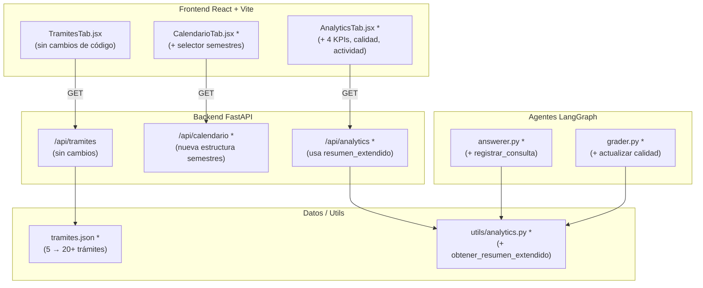

# Documento de Diseño — Mejoras Trámites, Calendario y Analytics

## Overview

Este documento describe el diseño técnico de tres mejoras incrementales sobre el Copiloto
Administrativo Agéntico de la Universidad de Antioquia:

1. **Expansión del catálogo de trámites**: ampliar `data/tramites/tramites.json` de 5 a 20+
   trámites sin modificar el código del agente ni el esquema existente.
2. **Calendario multi-semestre**: refactorizar el endpoint `GET /api/calendario` para exponer
   múltiples semestres (2025-1, 2025-2, 2026-1, 2026-2) con metadatos de estado y tipo de
   evento; actualizar `CalendarioTab.jsx` para incluir selector de semestres.
3. **Corrección y expansión de analytics**: corregir el bug por el que `registrar_consulta()`
   nunca se invocaba; añadir `obtener_resumen_extendido()` en `utils/analytics.py`; actualizar
   el endpoint `/api/analytics` y expandir `AnalyticsTab.jsx` con 4 KPI cards, distribución
   de calidad e indicador de actividad reciente.

Ninguna de las tres mejoras modifica la arquitectura central del grafo LangGraph ni el flujo
de inferencia existente. Son cambios acotados de datos, un endpoint REST y dos nodos del grafo.

---

## Architecture

Las tres mejoras son ortogonales entre sí y no se introducen dependencias cruzadas nuevas.
El diagrama siguiente muestra las partes del sistema afectadas (resaltadas con `*`):



### Decisiones de diseño

| Decisión | Alternativa descartada | Razón |
|----------|----------------------|-------|
| Calendario embebido en la función Python (hardcoded) | Base de datos / archivo JSON externo | Los datos del calendario son estables por semestre; no requieren CRUD ni ingesta dinámica. El hardcoding simplifica el despliegue sin sacrificar extensibilidad para 4 semestres. |
| `registrar_consulta` en `answerer_node` (path feliz) y `except` (path error) | En `grader_node` | El Answerer siempre se ejecuta; el Grader puede omitirse o fallar. Registrar en Answerer garantiza cobertura completa. |
| `obtener_resumen_extendido` como función independiente | Parámetros opcionales en `obtener_resumen` | Mantiene backward compatibility: nada que ya llame `obtener_resumen()` se rompe. |
| Estado de calidad `"pendiente"` antes del Grader | No registrar hasta que Grader evalúe | Garantiza que toda consulta queda registrada incluso si el Grader nunca corre (timeout, excepción). |

---

## Components and Interfaces

### 1. `data/tramites/tramites.json` — Expansión de catálogo

**Tipo de cambio:** Solo datos. No se modifica ningún archivo `.py`.

El `Tramite_Agent` ya carga el JSON dinámicamente mediante `_cargar_tramites()` y el algoritmo
de búsqueda por keywords no depende de la cardinalidad del catálogo. Por lo tanto, agregar 15+
trámites nuevos requiere únicamente extender el array `"tramites"` en el JSON.

**Trámites nuevos a agregar** (15 adicionales para llegar a 20+):

| # | Nombre | Categoría |
|---|--------|-----------|
| 6 | Liquidación y Pago de Matrícula | `financiero` |
| 7 | Transferencia Interna entre Programas | `gestion_academica` |
| 8 | Solicitud de Paz y Salvo Académico | `certificados` |
| 9 | Solicitud de Duplicado de Carné | `certificados` |
| 10 | Homologación de Materias | `gestion_academica` |
| 11 | Reserva de Cupo por Período Académico | `gestion_academica` |
| 12 | Solicitud de Reintegro | `gestion_academica` |
| 13 | Inscripción de Asignaturas en Período Ordinario | `gestion_academica` |
| 14 | Solicitud de Grado | `grado` |
| 15 | Solicitud de Doble Titulación | `grado` |
| 16 | Cambio de Jornada o Modalidad | `gestion_academica` |
| 17 | Reconocimiento de Saberes Previos | `normativa_academica` |
| 18 | Solicitud de Permiso de Trabajo de Campo / Práctica | `normativa_academica` |
| 19 | Constancia de Matrícula Activa | `certificados` |
| 20 | Solicitud de Préstamo en Biblioteca UdeA | `biblioteca` |

**Restricciones de esquema** (idénticas al esquema existente):

```python
ESQUEMA_TRAMITE = {
    "nombre":               str,                    # no vacío
    "descripcion":          str,                    # no vacío
    "categoria":            str,                    # ∈ CATEGORIAS_VALIDAS
    "tiempo_estimado":      str,                    # no vacío
    "costo":                str,                    # no vacío
    "oficina":              str,                    # no vacío
    "url_oficial":          str,                    # comienza con "https://"
    "keywords":             list[str],              # >= 5 entradas únicas, minúsculas
    "pasos":                list[str],              # >= 3, cada uno comienza con "N. "
    "documentos_requeridos":list[str],              # >= 1 entrada no vacía
    "advertencias":         list[str],              # >= 1 entrada no vacía
}

CATEGORIAS_VALIDAS = {
    "certificados", "gestion_academica", "grado",
    "bienestar", "normativa_academica", "biblioteca", "financiero"
}
```

### 2. `backend/main.py` — Endpoint `/api/calendario` refactorizado

**Cambio:** Reemplazar la función `calendario()` actual (que retorna un semestre único) por una
nueva versión que retorna cuatro semestres en el campo `semestres`.

```python
# ANTES (estructura actual)
@app.get("/api/calendario")
def calendario():
    return {
        "semestre": "2026-1",
        "eventos": [...]
    }

# DESPUÉS (nueva estructura)
@app.get("/api/calendario")
def calendario():
    return {
        "semestres": [
            {
                "semestre":    "2025-1",
                "estado":      "historico",
                "descripcion": "Primer semestre académico 2025 (enero–junio)",
                "eventos": [...]   # eventos con tipo_evento
            },
            {
                "semestre":    "2025-2",
                "estado":      "historico",
                "descripcion": "Segundo semestre académico 2025 (julio–diciembre)",
                "eventos": [...]
            },
            {
                "semestre":    "2026-1",
                "estado":      "activo",
                "descripcion": "Primer semestre académico 2026 (enero–junio) — Período vigente",
                "eventos": [...]
            },
            {
                "semestre":    "2026-2",
                "estado":      "futuro",
                "descripcion": "Segundo semestre académico 2026 (julio–diciembre) — Fechas provisionales",
                "eventos": [...]
            },
        ]
    }
```

**Estructura de cada evento:**

```python
{
    "evento":      str,    # nombre del evento académico
    "inicio":      str,    # fecha de inicio, e.g. "27 enero 2026" o ""
    "fin":         str,    # fecha de fin o ""
    "notas":       str,    # >= 20 caracteres con contexto académico
    "tipo_evento": str,    # ∈ {"matricula","clases","evaluacion","receso","grado","tramite","otro"}
}
```

**Valores de `tipo_evento` por tipo de evento:**

| Evento | tipo_evento |
|--------|-------------|
| Matrícula financiera, adiciones | `matricula` |
| Inicio/fin de clases | `clases` |
| Cortes evaluativos, exámenes finales, habilitaciones | `evaluacion` |
| Semana de receso, vacaciones | `receso` |
| Solicitud de grado, ceremonias de grado | `grado` |
| Cancelación de materias, inscripciones | `tramite` |
| Entrega de notas, otros | `otro` |

### 3. `frontend/src/components/CalendarioTab.jsx` — Selector de semestres

**Cambio:** Adaptar el componente para consumir la nueva estructura `{ semestres: [...] }` y
añadir un selector de semestres con selección automática del activo.

**Lógica de selección inicial:**
```javascript
// Seleccionar el semestre activo, o el primero si ninguno es activo
const semestreInicial = semestres.find(s => s.estado === 'activo') || semestres[0]
```

**Estructura de estado del componente:**
```javascript
const [semestres, setSemestres]           = useState([])
const [semestreActual, setSemestreActual] = useState(null)
const [loading, setLoading]              = useState(true)
```

**Selector de semestres:** botones/tabs horizontales. El semestre con `estado === 'activo'`
lleva un estilo diferenciado (fondo `C.petroleo`, texto blanco). Los semestres futuros llevan
un sufijo de texto "(provisional)".

**Etiqueta de fechas provisionales:** cuando `semestreActual.estado === 'futuro'`, se muestra
un banner visible encima de la tabla con el texto:
> ⚠️ Las fechas de este semestre son provisionales y pueden cambiar.

**Tabla de eventos:** sin cambios en columnas. Se añade la columna `Tipo` con un badge de color
según `tipo_evento` para codificación visual (opcional; ver Testing Strategy).

---

### 4. `agentes/answerer.py` — Integración de analytics

**Cambio:** Agregar dos llamadas a `registrar_consulta()` en `answerer_node`:
- Al final del path feliz (después de generar la respuesta), con `calidad_final="pendiente"`.
- En el bloque `except`, con `calidad_final="error"`.

```python
# Al final del try, antes del return
from utils.analytics import registrar_consulta
registrar_consulta(
    intencion=estado.get("intencion", "desconocida"),
    perfil_usuario=estado.get("perfil_usuario", "desconocido"),
    calidad_final="pendiente",       # el Grader actualizará este valor
    agente_usado=agente_usado,
    es_urgente=estado.get("es_urgente", False),
)

# En el bloque except, antes del return de fallback
registrar_consulta(
    intencion=estado.get("intencion", "desconocida"),
    perfil_usuario=estado.get("perfil_usuario", "desconocido"),
    calidad_final="error",
    agente_usado="error",
    es_urgente=estado.get("es_urgente", False),
)
```

**Import:** añadir `from utils.analytics import registrar_consulta` en los imports del módulo.
El import dentro de la función es también aceptable para evitar importación circular durante
tests, pero se prefiere al nivel de módulo.

---

### 5. `agentes/grader.py` — Actualización de calidad en analytics

**Cambio:** Al final de `grader_node()`, actualizar la última entrada del registro con la
calidad evaluada. Se añade una nueva función `actualizar_ultima_calidad()` en `utils/analytics.py`.

```python
# En grader_node, antes del return
from utils.analytics import actualizar_ultima_calidad
actualizar_ultima_calidad(calidad)
```

---

### 6. `utils/analytics.py` — `obtener_resumen_extendido()` y `actualizar_ultima_calidad()`

**Función nueva `actualizar_ultima_calidad`:**

```python
def actualizar_ultima_calidad(calidad: str) -> None:
    """Actualiza calidad_final de la última entrada registrada."""
    with _lock:
        if _registro:
            _registro[-1]["calidad_final"] = calidad
```

**Función nueva `obtener_resumen_extendido`:**

```python
def obtener_resumen_extendido() -> dict:
    """
    Extiende obtener_resumen() con campos adicionales sin modificar los existentes.
    Campos adicionales:
      - por_calidad (dict str→int)
      - tasa_urgentes (float, round(urgentes/total*100, 1) o 0.0)
      - agente_mas_usado (str, primero alfabético en empate, "" si vacío)
      - intencion_mas_frecuente (str, primero alfabético en empate, "" si vacío)
      - consultas_ultimo_minuto (int)
    """
```

**Firma completa:**

```python
def obtener_resumen_extendido() -> dict:
    base = obtener_resumen()           # reutiliza lógica existente
    with _lock:
        copia = list(_registro)

    # por_calidad
    por_calidad: dict[str, int] = {}
    for e in copia:
        c = e.get("calidad_final", "desconocida")
        por_calidad[c] = por_calidad.get(c, 0) + 1

    total = base["total"]
    urgentes = base["urgentes"]

    # tasa_urgentes
    tasa_urgentes = round(urgentes / total * 100, 1) if total > 0 else 0.0

    # agente_mas_usado
    por_agente = base["por_agente"]
    agente_mas_usado = (
        min(k for k, v in por_agente.items() if v == max(por_agente.values()))
        if por_agente else ""
    )

    # intencion_mas_frecuente
    por_intencion = base["por_intencion"]
    intencion_mas_frecuente = (
        min(k for k, v in por_intencion.items() if v == max(por_intencion.values()))
        if por_intencion else ""
    )

    # consultas_ultimo_minuto
    ahora = datetime.now()
    consultas_ultimo_minuto = sum(
        1 for e in copia
        if (ahora - datetime.fromisoformat(e["timestamp"])).total_seconds() <= 60
    )

    return {
        **base,
        "por_calidad": por_calidad,
        "tasa_urgentes": tasa_urgentes,
        "agente_mas_usado": agente_mas_usado,
        "intencion_mas_frecuente": intencion_mas_frecuente,
        "consultas_ultimo_minuto": consultas_ultimo_minuto,
    }
```

---

### 7. `backend/main.py` — Endpoint `/api/analytics` actualizado

```python
@app.get("/api/analytics")
def analytics():
    try:
        from utils.analytics import obtener_resumen_extendido
        return obtener_resumen_extendido()
    except Exception:
        return {
            "total": 0, "urgentes": 0, "tasa_aceptable": 0.0,
            "por_intencion": {}, "por_perfil": {}, "por_agente": {},
            "por_calidad": {}, "tasa_urgentes": 0.0,
            "agente_mas_usado": "", "intencion_mas_frecuente": "",
            "consultas_ultimo_minuto": 0,
        }
```

### 8. `frontend/src/components/AnalyticsTab.jsx` — Dashboard expandido

**Cambios:**

1. **4 KPI cards fijas** (siempre que `data.total > 0`):
   - `MessageSquare` / Total consultas → `data.total`
   - `AlertTriangle` / Casos urgentes → `data.urgentes`
   - `CheckCircle` / Calidad aceptable → `${data.tasa_aceptable}%`
   - `Bot` / Agentes activos → `Object.keys(data.por_agente ?? {}).length`

2. **Sección "Distribución de calidad"** — renderizada con el mismo patrón de barras
   horizontales que `por_intencion` y `por_perfil`, usando `data.por_calidad`.

3. **Indicador de actividad reciente** — cuando `data.consultas_ultimo_minuto > 0`,
   mostrar un badge verde con el texto `"{N} consulta(s) en el último minuto"`.

4. **Estado vacío mejorado** — cuando `data.total === 0` (o `data === null`), mostrar
   mensaje: "Realiza consultas en el chat para ver estadísticas aquí."

5. **Botón Actualizar** — ya existe; no se modifica su lógica.

---

## Data Models

### Modelo de respuesta `/api/calendario`

```typescript
interface CalendarioResponse {
  semestres: Semestre[]
}

interface Semestre {
  semestre:    string          // formato AAAA-S, e.g. "2026-1"
  estado:      "historico" | "activo" | "futuro"
  descripcion: string
  eventos:     Evento[]
}

interface Evento {
  evento:      string
  inicio:      string          // "DD mes AAAA" o ""
  fin:         string          // "DD mes AAAA" o ""
  notas:       string          // >= 20 caracteres cuando no vacío
  tipo_evento: "matricula" | "clases" | "evaluacion" | "receso" | "grado" | "tramite" | "otro"
}
```

### Modelo de respuesta `/api/analytics` (extendido)

```typescript
interface AnalyticsExtendedResponse {
  // Campos heredados de obtener_resumen()
  total:                  number         // int >= 0
  urgentes:               number         // int >= 0
  tasa_aceptable:         number         // float, porcentaje con 1 decimal
  por_intencion:          Record<string, number>
  por_perfil:             Record<string, number>
  por_agente:             Record<string, number>

  // Campos nuevos de obtener_resumen_extendido()
  por_calidad:            Record<string, number>
  tasa_urgentes:          number         // float, porcentaje con 1 decimal
  agente_mas_usado:       string         // "" si vacío
  intencion_mas_frecuente:string         // "" si vacío
  consultas_ultimo_minuto:number         // int >= 0
}
```

### Modelo de entrada al Analytics Registry

```python
# Entrada sin cambios — misma estructura que actualmente
{
    "timestamp":      str,   # ISO 8601
    "intencion":      str,
    "perfil_usuario": str,
    "calidad_final":  str,   # "pendiente" → luego reemplazado por Grader
    "agente_usado":   str,
    "es_urgente":     bool,
}
```

### Esquema de trámite en `tramites.json`

Sin cambios respecto al esquema existente. Ver sección Components and Interfaces § 1.

---

## Correctness Properties

*Una propiedad es una característica o comportamiento que debe ser verdadero en todas las
ejecuciones válidas del sistema — esencialmente, un enunciado formal sobre lo que el sistema
debe hacer. Las propiedades sirven como puente entre especificaciones legibles por humanos y
garantías de corrección verificables automáticamente.*

### Reflexión de redundancia

Antes de escribir las propiedades se revisaron todas las clasificadas como PROPERTY en el
prework para eliminar redundancias:

- El **esquema de trámite** (P3) ya cubre las restricciones de keywords únicos, formato de
  pasos y url_oficial que aparecen en los requisitos 5.2–5.4 y 5.6. No se crean propiedades
  separadas para esos sub-campos.
- El **schema de `obtener_resumen_extendido()`** (P14) incluye todos los campos de
  `obtener_resumen()` (P13). P13 queda subsumed — se conserva solo P14.
- El **keyword lookup** (P2) cubre los sinónimos del requisito 1.6 porque el generador
  de prueba muestrea cualquier keyword de la lista del trámite, incluidos los sinónimos.
- **P8 (tipo_evento) y P9 (longitud de notas)** son independientes de P7 (esquema de
  semestre) — P7 solo verifica presencia de campos, no sus valores permitidos. Se conservan
  las tres.

Resultado: 16 propiedades únicas, sin redundancia.

---

### Property 1: Cardinalidad del catálogo de trámites

*Para cualquier* lectura del archivo `data/tramites/tramites.json` en un estado válido,
el número de trámites en la lista `tramites` debe ser mayor o igual a 20.

**Validates: Requirements 1.1**

---

### Property 2: Keyword lookup produce puntuación positiva

*Para cualquier* trámite en `tramites.json` y *para cualquier* keyword `k` en su lista
`keywords`, cuando se invoca `_buscar_tramite_relevante(tramites, consulta)` con una
consulta que contiene `k` como subcadena, la puntuación retornada debe ser mayor a 0.

**Validates: Requirements 1.2, 1.6**

---

### Property 3: Integridad del esquema de cada trámite

*Para cualquier* trámite en `tramites.json`:
- Los campos `nombre`, `descripcion`, `categoria`, `tiempo_estimado`, `costo`, `oficina`,
  `url_oficial` deben ser strings no vacíos.
- `url_oficial` debe comenzar con `"https://"`.
- `categoria` debe pertenecer al conjunto `{certificados, gestion_academica, grado,
  bienestar, normativa_academica, biblioteca, financiero}`.
- `keywords` debe ser una lista de al menos 5 strings únicos en minúsculas.
- `pasos` debe ser una lista de al menos 3 strings, cada uno comenzando con `"N. "`.
- `documentos_requeridos` y `advertencias` deben ser listas de al menos 1 string no vacío.

**Validates: Requirements 1.3, 5.2, 5.3, 5.4, 5.6**

---

### Property 4: Categorías válidas en el catálogo

*Para cualquier* trámite en `tramites.json`, el valor del campo `categoria` debe
pertenecer exactamente al conjunto de categorías válidas definido en el diseño.

**Validates: Requirements 1.5**

---

### Property 5: Cobertura de términos requeridos en el catálogo

*Para el catálogo completo de trámites*, la unión de todos los keywords de todos los
trámites debe contener cada uno de los 15 términos requeridos: `"matrícula"`,
`"certificado"`, `"cancelar"`, `"beca"`, `"grado"`, `"transferencia"`,
`"homologación"`, `"reintegro"`, `"paz y salvo"`, `"carné"`, `"constancia"`,
`"biblioteca"`, `"recurso"`, `"inscripción"`, y `"reserva"`.

**Validates: Requirements 5.5**

---

### Property 6: Semestres requeridos en la respuesta de `/api/calendario`

*Para cualquier* invocación de la función `calendario()`, la respuesta debe contener un
campo `semestres` que incluya exactamente los identificadores `"2025-1"`, `"2025-2"`,
`"2026-1"` y `"2026-2"`, todos en la misma respuesta.

**Validates: Requirements 2.1**

---

### Property 7: Esquema válido de cada semestre en la respuesta

*Para cualquier* semestre en la lista `semestres` retornada por `calendario()`:
- El campo `semestre` debe coincidir con el patrón `^\d{4}-[12]$`.
- El campo `estado` debe ser uno de `{historico, activo, futuro}`.
- El campo `descripcion` debe ser un string no vacío.
- El campo `eventos` debe ser una lista (puede estar vacía).

**Validates: Requirements 2.2**

---

### Property 8: `tipo_evento` pertenece al conjunto de valores válidos

*Para cualquier* evento en cualquier semestre de la respuesta de `calendario()`, el
campo `tipo_evento` debe pertenecer al conjunto
`{matricula, clases, evaluacion, receso, grado, tramite, otro}`.

**Validates: Requirements 2.3**

---

### Property 9: Notas de eventos tienen longitud suficiente

*Para cualquier* evento en cualquier semestre donde el campo `notas` no esté vacío,
`len(ev["notas"]) >= 20`.

**Validates: Requirements 2.4**

---

### Property 10: Selección automática del semestre activo en CalendarioTab

*Para cualquier* lista de semestres que contenga al menos un semestre con
`estado === 'activo'`, el estado interno `semestreActual` del componente
`CalendarioTab` después del render inicial debe ser el primer semestre con
`estado === 'activo'` de esa lista.

**Validates: Requirements 2.9**

---

### Property 11: Answerer registra consulta en analytics tras cada ejecución exitosa

*Para cualquier* estado válido del grafo pasado a `answerer_node()`, si la función
completa sin excepción, el registro de analytics debe tener exactamente una entrada
más que antes de la llamada, y esa entrada nueva debe tener `calidad_final="pendiente"`,
`intencion` igual al campo del estado, `perfil_usuario` igual al campo del estado,
y `es_urgente` igual al campo del estado.

**Validates: Requirements 3.1**

---

### Property 12: Grader actualiza `calidad_final` de la última entrada

*Para cualquier* estado con `respuesta_candidata` no vacía, y dado que el registro de
analytics tiene al menos una entrada con `calidad_final="pendiente"`, después de
ejecutar `grader_node()` la última entrada del registro debe tener `calidad_final`
igual a uno de `{aceptable, mejorar, sin_info}` (distinto de `"pendiente"`).

**Validates: Requirements 3.2**

---

### Property 14: `obtener_resumen_extendido()` retorna schema correcto con cálculos válidos

*Para cualquier* lista de entradas generadas aleatoriamente en el registro de analytics:
- El retorno contiene todos los campos de `obtener_resumen()` sin modificar sus tipos.
- `por_calidad` es un dict `str→int` con conteos que suman `total`.
- `tasa_urgentes` = `round(urgentes/total*100, 1)` cuando `total > 0`, ó `0.0` cuando
  `total = 0`.
- `agente_mas_usado` es el agente con más entradas en `por_agente`; en empate, el
  primero en orden alfabético; `""` si `por_agente` es vacío.
- `intencion_mas_frecuente` sigue la misma lógica que `agente_mas_usado` sobre
  `por_intencion`.
- `consultas_ultimo_minuto` es un entero no negativo y no puede superar `total`.

**Validates: Requirements 4.1, 3.3**

---

### Property 15: AnalyticsTab muestra exactamente 4 KPI cards cuando `total > 0`

*Para cualquier* objeto `data` con `total > 0` pasado al componente `AnalyticsTab`,
el componente debe renderizar exactamente 4 elementos `KPICard`.

**Validates: Requirements 4.3**

---

### Property 16: Sección de distribución de calidad aparece cuando `por_calidad` no está vacío

*Para cualquier* objeto `data` con `por_calidad` poblado (al menos una clave),
el componente `AnalyticsTab` debe renderizar una sección con el encabezado
`"Distribución de calidad"`.

**Validates: Requirements 4.4**

---

### Property 17: Indicador de actividad reciente aparece cuando `consultas_ultimo_minuto > 0`

*Para cualquier* entero `N > 0` pasado como `consultas_ultimo_minuto` en `data`,
el componente `AnalyticsTab` debe mostrar un elemento de texto que contenga
`"{N} consulta(s) en el último minuto"`.

**Validates: Requirements 4.5**

---

## Error Handling

| Escenario | Componente | Comportamiento |
|-----------|-----------|----------------|
| `tramites.json` no existe | `tramite_agent_node` | Ya implementado: captura `FileNotFoundError`, retorna `tramite_guia=None`, `agente_usado="tramite_sin_match"`, log de error. Sin cambios requeridos. |
| `tramites.json` JSON inválido | `tramite_agent_node` | Ya implementado: captura `json.JSONDecodeError` en el `except` genérico. Sin cambios requeridos. |
| `registrar_consulta()` lanza excepción | `answerer_node` | La llamada a `registrar_consulta` debe estar envuelta en `try/except` independiente para no interrumpir el retorno de la respuesta al usuario. Se loguea el error y se continúa. |
| `actualizar_ultima_calidad()` con registro vacío | `utils/analytics.py` | La función verifica `if _registro:` antes de mutar; es no-op si el registro está vacío. |
| `/api/calendario` — excepción inesperada | `backend/main.py` | La función `calendario()` retorna datos hardcoded sin I/O, por lo que no debería fallar. Si falla, FastAPI retorna HTTP 500 automáticamente. |
| `/api/analytics` — excepción al importar analytics | `backend/main.py` | El `except` retorna un objeto vacío con todos los campos en cero/vacío para que el frontend no crashee. |
| `CalendarioTab` — API retorna estructura antigua | `CalendarioTab.jsx` | El componente verifica `r.data.semestres` con fallback a `[]`; si recibe la estructura anterior, el selector no aparece y la tabla queda vacía (degradación controlada). |
| `AnalyticsTab` — campos nuevos ausentes en respuesta | `AnalyticsTab.jsx` | Usar optional chaining y valores por defecto: `data.por_calidad ?? {}`, `data.consultas_ultimo_minuto ?? 0`. |

---

## Testing Strategy

### Enfoque

Se combina **pruebas unitarias con ejemplos específicos** para comportamientos concretos y
**pruebas basadas en propiedades con Hypothesis** para invariantes universales.

**Biblioteca PBT:** `hypothesis` (Python) para el backend Python.
**Biblioteca PBT frontend:** `@fast-check/jest` o pruebas de componente con `@testing-library/react` para las propiedades de UI.

**Configuración mínima:** 100 iteraciones por prueba de propiedad (`@settings(max_examples=100)`).

**Etiquetado:**
```python
# Feature: mejoras-tramites-calendario-analytics, Property N: <texto>
@settings(max_examples=100)
@given(...)
def test_property_N_nombre(...):
    ...
```

---

### Pruebas de propiedad con Hypothesis (Python)

| Propiedad | Archivo de test | Generadores de entrada |
|-----------|----------------|----------------------|
| P1: Cardinalidad tramites >= 20 | `tests/test_tramites.py` | `json.load` del archivo real; no requiere generador aleatorio |
| P2: Keyword lookup → puntuación > 0 | `tests/test_tramites.py` | `st.sampled_from(tramites)` luego `st.sampled_from(tramite["keywords"])` |
| P3: Esquema completo de trámite | `tests/test_tramites.py` | `st.sampled_from(tramites)` — verifica cada campo del trámite muestreado |
| P4: Categorías válidas | `tests/test_tramites.py` | `st.sampled_from(tramites)` |
| P5: Cobertura de términos requeridos | `tests/test_tramites.py` | Carga el catálogo completo; no requiere generador |
| P6: Semestres requeridos en calendario | `tests/test_calendario.py` | Sin generador; llama `calendario()` directamente |
| P7: Esquema de semestre | `tests/test_calendario.py` | `st.sampled_from(calendario()["semestres"])` |
| P8: `tipo_evento` válido | `tests/test_calendario.py` | `st.sampled_from(todos_los_eventos)` |
| P9: Longitud de notas | `tests/test_calendario.py` | `st.sampled_from(eventos_con_notas)` |
| P11: Answerer registra consulta | `tests/test_analytics.py` | `st.builds(estado_valido)` con mock del LLM |
| P12: Grader actualiza calidad | `tests/test_analytics.py` | `st.text(min_size=101)` como `respuesta_candidata` |
| P14: Schema y cálculos de `obtener_resumen_extendido` | `tests/test_analytics.py` | `st.lists(st.builds(entrada_analytics), min_size=1, max_size=200)` |

**Ejemplo de generador para P14:**
```python
from hypothesis import given, settings, strategies as st
from utils.analytics import limpiar_registro, registrar_consulta, obtener_resumen_extendido

intenciones = st.sampled_from(["normativa", "trámite", "calendario", "urgencia", "otro"])
perfiles    = st.sampled_from(["pregrado", "posgrado", "docente", "administrativo"])
calidades   = st.sampled_from(["aceptable", "mejorar", "sin_info", "pendiente", "error"])
agentes     = st.sampled_from(["rag_agent", "tramite_agent", "search_agent", "error"])

@settings(max_examples=100)
@given(st.lists(
    st.tuples(intenciones, perfiles, calidades, agentes, st.booleans()),
    min_size=1, max_size=200
))
def test_property_14_resumen_extendido_schema(entradas):
    # Feature: mejoras-tramites-calendario-analytics, Property 14
    limpiar_registro()
    for intencion, perfil, calidad, agente, urgente in entradas:
        registrar_consulta(intencion, perfil, calidad, agente, urgente)
    resultado = obtener_resumen_extendido()
    total = resultado["total"]
    urgentes = resultado["urgentes"]
    assert isinstance(resultado["por_calidad"], dict)
    assert sum(resultado["por_calidad"].values()) == total
    expected_tasa = round(urgentes / total * 100, 1) if total > 0 else 0.0
    assert resultado["tasa_urgentes"] == expected_tasa
    assert isinstance(resultado["consultas_ultimo_minuto"], int)
    assert 0 <= resultado["consultas_ultimo_minuto"] <= total
```

---

### Pruebas de propiedad de UI (P10, P15, P16, P17)

Para las propiedades de componentes React se usa `@testing-library/react` con datos
generados programáticamente (sin fast-check) en `frontend/src/test/`:

| Propiedad | Archivo | Estrategia |
|-----------|---------|-----------|
| P10: Selección automática semestre activo | `CalendarioTab.test.jsx` | Generar 10-20 listas aleatorias con un semestre activo en posición aleatoria; verificar que `semestreActual.semestre === activoEsperado` |
| P15: 4 KPI cards | `AnalyticsTab.test.jsx` | Generar `data` con `total` en rango 1–1000; contar elementos con `data-testid="kpi-card"` |
| P16: Sección distribución calidad | `AnalyticsTab.test.jsx` | Generar `por_calidad` con 1–5 claves; verificar texto "Distribución de calidad" |
| P17: Indicador actividad reciente | `AnalyticsTab.test.jsx` | Para N en 1–100, verificar texto `${N} consulta(s) en el último minuto` |

---

### Pruebas unitarias (ejemplos específicos)

| Caso | Archivo | Qué verifica |
|------|---------|-------------|
| `tramites.json` con JSON inválido | `tests/test_tramites.py` | `tramite_agent_node` retorna `tramite_guia=None` sin excepción |
| Endpoint `/api/calendario` retorna 4 semestres | `tests/test_calendario.py` | Llamada directa a `calendario()`, verificar len == 4 |
| `CalendarioTab` muestra selector con múltiples semestres | `CalendarioTab.test.jsx` | Renderizar con 2+ semestres, verificar selector visible |
| `CalendarioTab` muestra banner "provisional" para futuro | `CalendarioTab.test.jsx` | Renderizar con semestre `estado="futuro"`, verificar banner |
| `AnalyticsTab` estado vacío cuando `total=0` | `AnalyticsTab.test.jsx` | Verificar mensaje de estado vacío |
| Thread safety de `registrar_consulta` | `tests/test_analytics.py` | 50 threads concurrentes; `total == 50` |
| Answerer registra `calidad_final="error"` en excepción | `tests/test_analytics.py` | Mock del LLM que lanza; verificar última entrada con `calidad="error"` |
| Botón Actualizar llama al endpoint | `AnalyticsTab.test.jsx` | `fireEvent.click`, verificar que `axios.get` fue llamado 2 veces |

### Prueba de smoke

```bash
# Verificar que tramites.json parsea sin errores
python -c "import json; data=json.load(open('data/tramites/tramites.json')); print(f'OK: {len(data[\"tramites\"])} trámites')"
```
